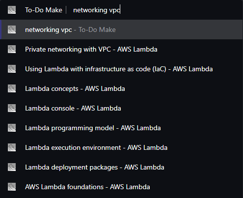
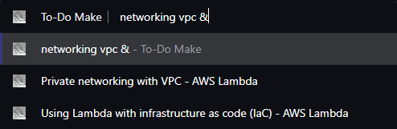
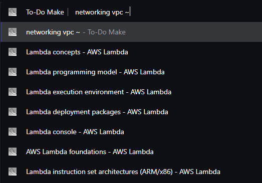

# Hawk
An indexing and productivity tool with easy backup features. Keep your to-do lists, your notes, and your documentation history in one place.

## Installation
Hawk is designed to be used on the latest version of Google Chrome. Install here: <a href="https://support.google.com/chrome/answer/95346?hl=en-GB&co=GENIE.Platform%3DDesktop#zippy=">Download and install Google Chrome</a>

Install and unzip the project repository to your preferred location.

To access the extension:
1. Open Google Chrome.
2. Click the three dots in the top right corner of the browser window.
3. Select Settings.
4. On the left sidebar, select Extensions (this will open in a new tab).
5. In the top right corner of the Extensions tab, toggle on Developer mode.
6. In the top left corner of the Extensions tab, select Load unpacked.
7. Navigate to the unzipped project folder and select it.
8. You should now be able to see To-Do Make among your extensions! If you wish to pin it to your browser taskbar for ease of access, click the Extensions puzzle piece beside the omnibar, and click the pin beside To-Do Make.

## Features

### Indexer

#### Indexing Rules

The extension's indexer will store the title and contents of certain pages. By default, the following regex rules apply:
- ^https://[^/]+.amazon.com/.*$
- ^https://atoz.amazon.work/.*$
- ^https://quip-amazon.com/.*$
- ^https://quip.com/.*$

There are four types of rules that can be used to trigger indexing:
- Site allow listing
- URL allow listing
- String matching allow listing
- Regex allow listing

All types of rules can be added and deleted. If you choose to remove all data and reset extension settings, the rules will be reset to the default four regex rules shown previously.

#### How Pages Are Indexed

When a page is indexed, the title and content are stored in local Chrome storage after stopwords in the page's content are removed to reduce unnecessary storage size.

The amazon-quip.com site is also indexed by default, but there is a 10 second delay to handle redirects. Pages on amazon-quip.com are polled every minute to update the indexed contents, overwriting the old contents.

#### Searching Indexed Documents

To begin searching for indexed pages, type "@i" in the omnibar and then hit Tab. Any text typed afterwards will be used to search through all indexed content to provide relevant results for your query. Searching uses a [BM25F](https://github.com/winkjs/wink-bm25-text-search) implementation by default, using a popular implementation of BM25 called [MiniSearch](https://github.com/lucaong/minisearch/blob/master/DESIGN_DOCUMENT.md) if BM25F provides no results or if search filtering is applied.

Both algorithms improve on TF-IDF and work on basic principles for scoring documents:
- The higher the frequency a term has within a document, the higher the score
- The less frequent a term is within all documents, a document with this term has a higher score
- The longer the term, the higher the score for documents containing this term

#### Search Filtering

By default when searching, all terms will be used to calculate the score each document is given. However, there are two operators that can be used to further filter the results shown by placing at the end of the search after a space:
- '&': shows documents that contain all of the terms in either their titles or contents
- '~': shows documents that contain the first term but none of the later terms

No filtering               |  AND filtering            |  AND-NOT filtering
:-------------------------:|:-------------------------:|:-------------------------:
  |    |  

#### Importing/Exporting Indexing Data

All data relating to indexing can be imported and exported:
- All rules of any type
- Corpus of content for indexed pages consisting of
    - Id
    - URL
    - Title
    - Body

You can access your notebook and to-do list through the extension icon in the taskbar.

You will need to start the indexer every time you open a new browser tab. You can do this by typing "@i" in the omnibar.

To back up your indexed data, click the extension icon, click Settings, and click Export indexed data to backup (JSON).

## Visuals
Notes feature:

Popup UI:

Indexing settings:

Dark mode:

To-do list:

